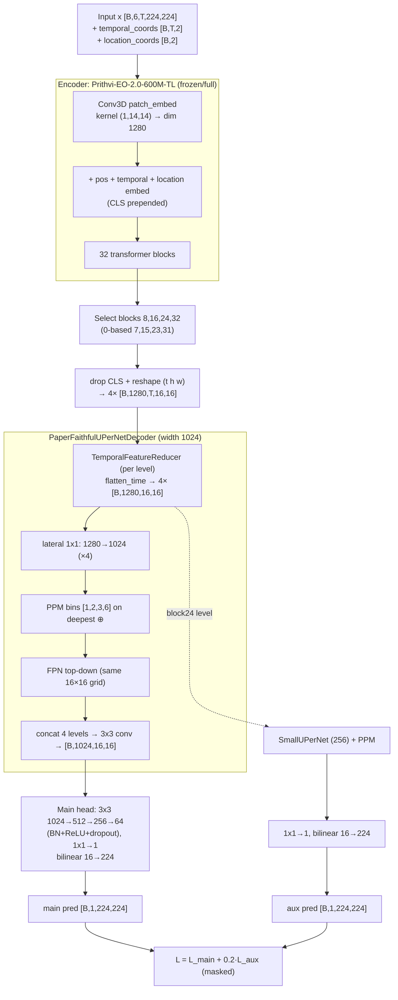

# Architecture

FARM-US = Prithvi-EO-2.0-600M-TL encoder → per-level temporal reduction →
ViT-adapted UPerNet decoder (FPN + PPM) → convolutional regression heads (main +
auxiliary). See [PAPER_REPLICATION_NOTES.md](PAPER_REPLICATION_NOTES.md) for
provenance of every choice.

## Diagram

## Tensor-shape table

| Stage | Shape |
|---|---|
| Input image | `[B, 6, T, 224, 224]` |
| temporal_coords / location_coords | `[B, T, 2]` / `[B, 2]` |
| Patch grid per frame | 16 × 16 |
| Per-block tokens | `[B, 1 + T·256, 1280]` |
| Reshaped level feature (×4) | `[B, 1280, T, 16, 16]` |
| After temporal reducer (×4) | `[B, 1280, 16, 16]` |
| After lateral proj (×4) | `[B, 1024, 16, 16]` |
| Fused decoder feature | `[B, 1024, 16, 16]` |
| Aux decoder feature | `[B, 256, 16, 16]` |
| Main / aux prediction | `[B, 1, 224, 224]` |

## Selected transformer blocks
Paper 1-based `{8,16,24,32}` → 0-based `{7,15,23,31}`; block 32 is the final
block (never index 32). Enforced by `one_based_to_index` and
`tests/test_prithvi_features.py`.

## Temporal reduction
`TemporalFeatureReducer` with modes `mean`, `attention`, `flatten_time`
(default). All emit `[B, D, 16, 16]`. The default stacks time into channels then
1×1-projects — the faithful home for the paper's "treat time as channels" prose.

## UPerNet flow
lateral 1×1 (1280→1024) → PPM on deepest (⊕) → FPN top-down (same-grid) →
concat 4 levels → 3×3 conv bottleneck.

## PPM
`AdaptiveAvgPool2d(b)` for b∈[1,2,3,6] → 1×1 conv+BN+ReLU → upsample → concat with
input → 3×3 conv fuse.

## FPN
Same-grid top-down additive fusion + per-level 3×3 smoothing (an isotropic ViT
has one spatial resolution at every block; see PAPER notes §7.5). Optional
`multiscale_fpn` variant resamples to a synthetic pyramid.

## Main head
`3×3 1024→512 → 3×3 512→256 → 3×3 256→64` (each BN+ReLU, optional dropout 0.1) →
`1×1 64→1` → bilinear upsample to 224. Linear output (regression).

## Auxiliary head
From the block-24 level: SmallUPerNet (256) → `1×1 256→1` → bilinear to 224. Deep
supervision only; can be disabled.

## Loss
`L_MSE = mean over valid pixels of (y − ŷ)²`; Huber optional;
`L_total = L_main + 0.2 · L_aux`. All masked to valid crop∧label∧HLS pixels.
