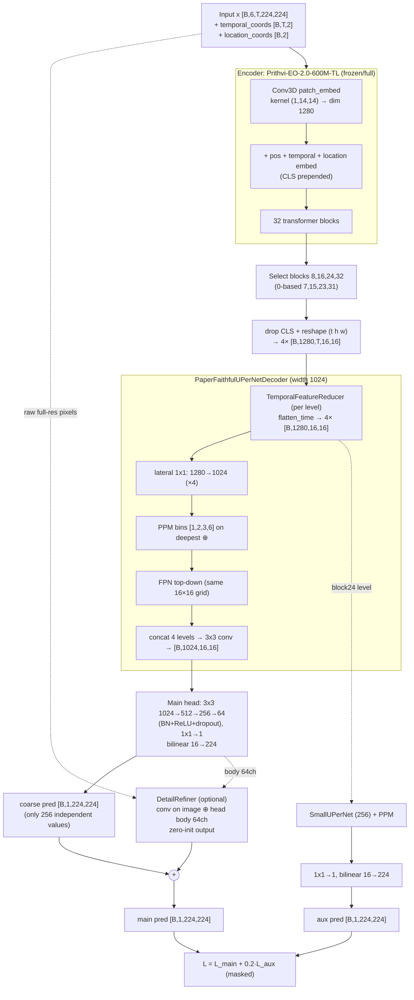

# Architecture

FARM-US = Prithvi-EO-2.0-600M-TL encoder → per-level temporal reduction →
ViT-adapted UPerNet decoder (FPN + PPM) → convolutional regression heads (main +
auxiliary). See [PAPER_REPLICATION_NOTES.md](PAPER_REPLICATION_NOTES.md) for
provenance of every choice.

## Diagram


```mermaid
flowchart TD
    X["Input x [B,6,T,224,224]<br/>+ temporal_coords [B,T,2]<br/>+ location_coords [B,2]"] --> ENC

    subgraph ENC["Encoder: Prithvi-EO-2.0-600M-TL (frozen/full)"]
      PE["Conv3D patch_embed<br/>kernel (1,14,14) → dim 1280"] --> POS["+ pos + temporal + location embed<br/>(CLS prepended)"]
      POS --> TB["32 transformer blocks"]
    end

    TB --> SEL["Select blocks 8,16,24,32<br/>(0-based 7,15,23,31)"]
    SEL --> RS["drop CLS + reshape (t h w)<br/>→ 4× [B,1280,T,16,16]"]
    RS --> TR["TemporalFeatureReducer (per level)<br/>flatten_time → 4× [B,1280,16,16]"]

    subgraph DEC["PaperFaithfulUPerNetDecoder (width 1024)"]
      TR --> LAT["lateral 1x1: 1280→1024 (×4)"]
      LAT --> PPM["PPM bins [1,2,3,6] on deepest ⊕"]
      PPM --> FPN["FPN top-down (same 16×16 grid)"]
      FPN --> FUSE["concat 4 levels → 3x3 conv → [B,1024,16,16]"]
    end

    FUSE --> HEAD["Main head: 3x3 1024→512→256→64<br/>(BN+ReLU+dropout), 1x1→1<br/>bilinear 16→224"]
    HEAD --> MOUT["coarse pred [B,1,224,224]<br/>(only 256 independent values)"]

    MOUT --> ADD(("+"))
    X -.raw full-res pixels.-> REF["DetailRefiner (optional)<br/>conv on image ⊕ head body 64ch<br/>zero-init output"]
    HEAD -.body 64ch.-> REF
    REF --> ADD
    ADD --> FINAL["main pred [B,1,224,224]"]

    TR -.block24 level.-> AUXD["SmallUPerNet (256) + PPM"]
    AUXD --> AUXH["1x1→1, bilinear 16→224"]
    AUXH --> AOUT["aux pred [B,1,224,224]"]

    FINAL --> L["L = L_main + 0.2·L_aux (masked)"]
    AOUT --> L
```

## Tensor-shape table

| Stage | Shape |
|---|---|
| Input image | `[B, 6, T, 224, 224]` |
| temporal_coords / location_coords | `[B, T, 2]` / `[B, 2]` |
| Patch grid per frame | 16 × 16 |
| Per-block tokens | `[B, 1 + T·256, 1280]` |
| Reshaped level feature (×4) | `[B, 1280, T, 16, 16]` |
| After temporal reducer (×4) | `[B, 1280, 16, 16]` |
| After lateral proj (×4) | `[B, 1024, 16, 16]` |
| Fused decoder feature | `[B, 1024, 16, 16]` |
| Aux decoder feature | `[B, 256, 16, 16]` |
| Main head body (pre-projection) | `[B, 64, 16, 16]` |
| Main / aux prediction | `[B, 1, 224, 224]` |
| **Independent values in the coarse map** | **256** (16×16), not 50,176 |

## Selected transformer blocks
Paper 1-based `{8,16,24,32}` → 0-based `{7,15,23,31}`; block 32 is the final
block (never index 32). Enforced by `one_based_to_index` and
`tests/test_prithvi_features.py`.

## Temporal reduction
`TemporalFeatureReducer` with modes `mean`, `attention`, `flatten_time`
(default). All emit `[B, D, 16, 16]`. The default stacks time into channels then
1×1-projects — the faithful home for the paper's "treat time as channels" prose.

## UPerNet flow
lateral 1×1 (1280→1024) → PPM on deepest (⊕) → FPN top-down (same-grid) →
concat 4 levels → 3×3 conv bottleneck.

## PPM
`AdaptiveAvgPool2d(b)` for b∈[1,2,3,6] → 1×1 conv+BN+ReLU → upsample → concat with
input → 3×3 conv fuse.

## FPN
Same-grid top-down additive fusion + per-level 3×3 smoothing (an isotropic ViT
has one spatial resolution at every block; see PAPER notes §7.5). Optional
`multiscale_fpn` variant resamples to a synthetic pyramid.

## Main head
`3×3 1024→512 → 3×3 512→256 → 3×3 256→64` (each BN+ReLU, optional dropout 0.1) →
`1×1 64→1` → bilinear upsample to 224. Linear output (regression).

## Auxiliary head
From the block-24 level: SmallUPerNet (256) → `1×1 256→1` → bilinear to 224. Deep
supervision only; can be disabled.

## The 256-DOF ceiling (read before changing the decoder)

Every level in the "pyramid" above sits on the **same 16×16 grid** — an isotropic
ViT has one spatial resolution at every block, so the FPN and PPM are operating on
four views of one grid, not on a true feature pyramid. There is no high-resolution
encoder stage to skip-connect from.

Consequently the head projects 16×16 = **256 independent values** and bilinearly
upsamples them to 50,176 pixels. One token covers 14 px × 30 m = **420 m** on the
ground. Two fields with different yields inside the same token cannot be told
apart, at any amount of training.

This is not a training failure and **no rearrangement of decoder features can fix
it** — any function of the encoder output is still a function of 256 numbers.
Recovering sub-token detail requires injecting *new* full-resolution information.
Three routes, in increasing cost:

| Route | Mechanism | Cost |
|---|---|---|
| `DetailRefiner` | raw 30 m pixels as a residual branch | ~20k params, implemented |
| Sub-token-shifted inference | average predictions over input offsets **not** multiples of 14, so the patch grid lands differently on the ground each pass | k× forward passes, inference only, not implemented |
| Upsample input, shrink ground extent | 224 px at 15 m → each token covers 210 m instead of 420 m (the paper did this for its 10 m monitor data, see BARC_TRANSFER.md) | linear in area, needs fine-tuning |

Shrinking the patch size is the one route to avoid: resizing the pretrained Conv3D
kernel is possible (FlexiViT-style) but 7×7 patches take T=8 from 2048 to 8192
tokens with quadratic attention, and degrade the pretrained representation.

## DetailRefiner (`models/detail_refiner.py`)

```
main = coarse_head_prediction + DetailRefiner(raw_image, head_body_64ch)
```

A ~20,801-parameter CNN: two 3×3 convs on the raw full-resolution image, concat
with the head's 64-channel body features, one 3×3 fuse conv, `1×1 → 1`. **No
BatchNorm** — fine-tuning batches are 4 on BARC, where batch statistics are
unreliable.

`out` is **zero-initialised** (weight and bias), so at step 0 the branch adds
exactly nothing and the model reproduces the checkpoint it was loaded from. It can
only learn to *add* detail. Earlier layers receive gradient once `out` takes its
first non-zero step (standard zero-conv behaviour). This is what makes
`init_from` + `refiner_only` a controlled experiment: the base is provably
unchanged, so any measured gain is attributable to the branch.

Two consequences worth knowing:
- **Weight decay must be 0.** Decaying a zero-initialised output layer pulls it
  back toward zero as fast as it learns; at `lr 1e-4, wd 0.01` the branch barely
  moved. Working settings are `lr 1e-2, wd 0.0`.
- With `finetune_mode: refiner_only`, every child module except `refiner` is
  frozen **and held in `eval()`** — `requires_grad=False` alone would still let BN
  running statistics drift and change the coarse prediction.

Measured result on BARC (measured 30 m labels, 11-fold LOYO): mean pixel
`pearson_r2` **0.465**, against 0.001–0.25 for fine-tuning the decoder instead.
Predicted std was 1.09 vs measured 13.56 bu/ac before the branch existed.

## Loss
`L_MSE = mean over valid pixels of (y − ŷ)²`; Huber optional;
`L_total = L_main + 0.2 · L_aux`. All masked to valid crop∧label∧HLS pixels.
